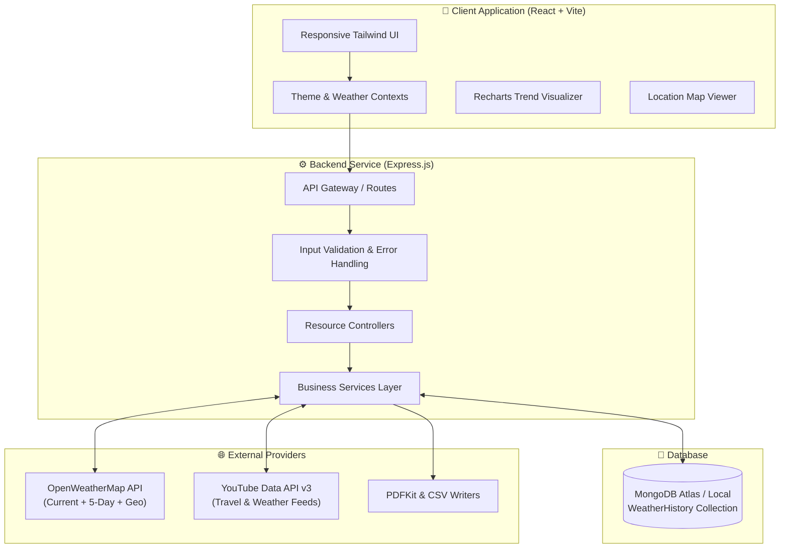
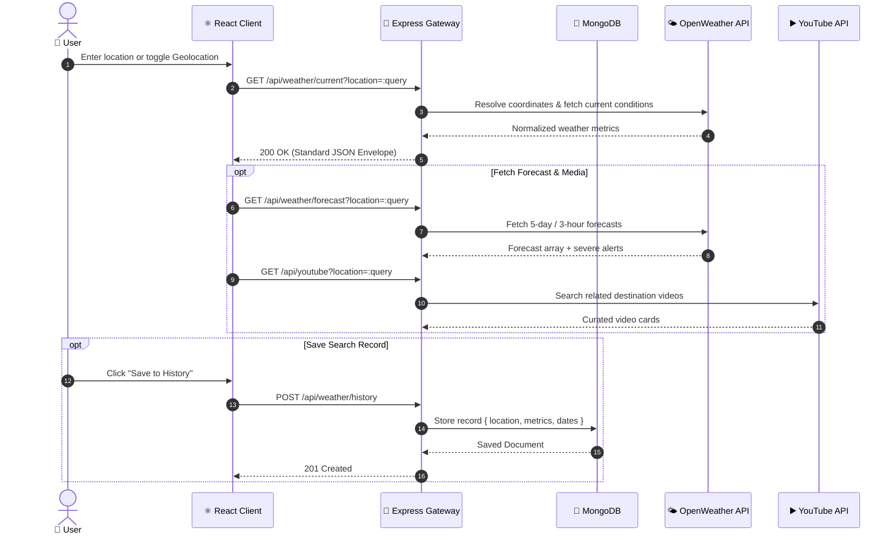

<div align="center">

# 🌦️ Weather Intelligence Platform

**A next-generation, full-stack weather intelligence suite powered by real-time analytics, automated reports, and multimedia exploration.**
   
[](https://github.com/ayushtripathi-45/Weather_Intelligence/stargazers)
[](https://reactjs.org/)
[](https://vitejs.dev/)
[](https://tailwindcss.com/)
[](https://nodejs.org/)
[](https://expressjs.com/)
[](https://www.mongodb.com/)
[](https://opensource.org/licenses/MIT)

<br/>

[Key Features](#-key-features) •
[System Architecture](#-system-architecture) •
[Data Flow](#-data-flow) •
[Tech Stack](#-tech-stack) •
[Quick Start](#-quick-start) •
[API Reference](#-api-reference) •
[Project Structure](#-project-structure)•

• [Live Demo](https://weather-intelligence-alpha.vercel.app) •

</div>

---

## 📖 Overview

**Weather Intelligence** bridges the gap between raw meteorological data and human-centric intelligence. Beyond simple temperature numbers, it combines live weather observation, 5-day predictive forecasts, interactive temperature analytics, geographical mapping, YouTube travel visualizers, full CRUD search history persistence, and multi-format reporting (JSON, CSV, and PDF).

> 💡 **Architectural Philosophy:** Zero API key exposure on the client. Every external integration is securely orchestrated, validated, and normalized through an Express REST gateway backed by MongoDB.

---

## ✨ Key Features

<table>
  <tr>
    <td width="50%">
      <h3>🌤️ Live Meteorological Hub</h3>
      <ul>
        <li>Real-time temperature, feels-like, humidity, wind velocity, and visibility.</li>
        <li>Dynamic weather condition badges and smart climate alerts.</li>
        <li>Search by city name, postal code, landmark, or GPS coordinates.</li>
      </ul>
    </td>
    <td width="50%">
      <h3>📈 5-Day Interactive Analytics</h3>
      <ul>
        <li>3-hour interval forecast grids and day-by-day temperature trends.</li>
        <li>Smooth responsive trend charts powered by <code>Recharts</code>.</li>
        <li>Visual indicators for highs, lows, precipitation, and conditions.</li>
      </ul>
    </td>
  </tr>
  <tr>
    <td width="50%">
      <h3>🗺️ Geospatial & Location Insights</h3>
      <ul>
        <li>Interactive map visualizer for pinpointing exact coordinates.</li>
        <li>Debounced geocoding search with live autocomplete candidates.</li>
        <li>Browser geolocation support for instant one-click localized weather.</li>
      </ul>
    </td>
    <td width="50%">
      <h3>🎥 Multimedia & Video Discovery</h3>
      <ul>
        <li>Automated location-based travel and weather video feeds via YouTube Data API.</li>
        <li>Graceful component isolation (frontend continues working even if external video API limits trigger).</li>
      </ul>
    </td>
  </tr>
  <tr>
    <td width="50%">
      <h3>💾 Search History & CRUD Workspace</h3>
      <ul>
        <li>Persist favorite queries and custom date intervals to MongoDB.</li>
        <li>Full CRUD capabilities: search, filter (newest/oldest), edit date ranges, and delete records.</li>
      </ul>
    </td>
    <td width="50%">
      <h3>📄 Multi-Format Export Engine</h3>
      <ul>
        <li>One-click export of saved history to formatted <b>JSON</b>.</li>
        <li>Spreadsheet-ready <b>CSV</b> exports.</li>
        <li>Server-generated, publication-ready branded <b>PDF</b> dossiers via PDFKit.</li>
      </ul>
    </td>
  </tr>
</table>

---

## 🏗️ System Architecture



---

## 🔄 Data Flow



---

## 🛠️ Tech Stack

| Domain | Technology | Purpose |
| :--- | :--- | :--- |
| **Frontend** | [React 18](https://react.dev/) | Declarative component-driven UI architecture |
| **Build Tool** | [Vite](https://vitejs.dev/) | Lightning-fast HMR and bundling |
| **Styling** | [Tailwind CSS](https://tailwindcss.com/) | Modern utility-first dark/light themed styling |
| **Data Viz** | [Recharts](https://recharts.org/) | Responsive charting for weather forecasting |
| **Icons** | [Lucide React](https://lucide.dev/) | Modern, clean vector iconography |
| **Backend** | [Node.js](https://nodejs.org/) & [Express](https://expressjs.com/) | RESTful API server and proxy gateway |
| **Database** | [MongoDB](https://www.mongodb.com/) & [Mongoose](https://mongoosejs.com/) | Document persistence for search records |
| **Exporting** | [PDFKit](https://pdfkit.org/) | Server-side programmatic PDF document generation |
| **APIs** | [OpenWeatherMap](https://openweathermap.org/) | Real-time weather, geocoding & multi-day forecast |
| **Media API** | [YouTube Data API v3](https://developers.google.com/youtube/v3) | Destination travel and weather video feeds |

---

## 🚀 Quick Start

### 1. Clone the Repository

```bash
git clone https://github.com/ayushtripathi-45/Weather_Intelligence.git
cd Weather_Intelligence
```

### 2. Install Dependencies

Install root, client, and server dependencies in one go:

```bash
npm run install:all
```

### 3. Configure Environment Variables

Create environment configuration files for both **server** and **client**:

#### Server Setup (`server/.env`)
```env
PORT=5000
CLIENT_URL=http://localhost:5173
MONGODB_URI=mongodb://127.0.0.1:27017/weather-intelligence
WEATHER_API_KEY=your_openweathermap_api_key
YOUTUBE_API_KEY=your_google_cloud_youtube_key
```

#### Client Setup (`client/.env`)
```env
VITE_API_BASE_URL=http://localhost:5000/api
```

> 🔑 **API Key Access:**
> - Get a free **OpenWeatherMap API Key** at [openweathermap.org](https://openweathermap.org/api).
> - Enable **YouTube Data API v3** in [Google Cloud Console](https://console.cloud.google.com/).

### 4. Run Development Servers

Start both frontend and backend concurrently with a single command:

```bash
npm run dev
```

| Service | Address | Notes |
| :--- | :--- | :--- |
| **Frontend** | `http://localhost:5173` | Vite Hot Reload enabled |
| **Backend API** | `http://localhost:5000` | Express REST Gateway |
| **Health Check** | `http://localhost:5000/api/health` | Status and uptime check |

---

## 📡 API Reference

All backend responses conform to a unified standard envelope:

```json
{
  "success": true,
  "message": "Operation completed successfully",
  "data": { ... }
}
```

### 🌤️ Weather Endpoints
| Method | Endpoint | Query / Body | Description |
| :--- | :--- | :--- | :--- |
| `GET` | `/api/weather/current` | `?location={query}` | Current temperature, wind, humidity, conditions |
| `GET` | `/api/weather/forecast` | `?location={query}` | 5-day / 3-hour forecast & alert notifications |
| `GET` | `/api/weather/coordinates` | `?lat={lat}&lon={lon}` | Weather conditions for geographical coordinates |

### 📂 History (CRUD) Endpoints
| Method | Endpoint | Payload / Params | Description |
| :--- | :--- | :--- | :--- |
| `GET` | `/api/weather/history` | `?search=&sort=newest` | Fetch all saved searches with filter & sorting |
| `POST` | `/api/weather/history` | `{ location, startDate, endDate }` | Geocode, fetch weather, and save search |
| `GET` | `/api/weather/history/:id`| Route Param | Retrieve specific saved weather record |
| `PUT` | `/api/weather/history/:id`| `{ location, startDate, endDate }` | Update saved record dates/location |
| `DELETE`| `/api/weather/history/:id`| Route Param | Delete saved weather record |

### 📍 Location & Media Endpoints
| Method | Endpoint | Query | Description |
| :--- | :--- | :--- | :--- |
| `GET` | `/api/location/search` | `?q={query}` | Autocomplete geocoding suggestions |
| `GET` | `/api/location/map` | `?location={lat,lon}` | Map coordinate validation |
| `GET` | `/api/youtube` | `?location={location}` | Up to 6 location-relevant travel videos |

### 📥 Export Endpoints
| Method | Endpoint | Output Format |
| :--- | :--- | :--- |
| `GET` | `/api/export/json` | `weather-history.json` |
| `GET` | `/api/export/csv` | `weather-history.csv` |
| `GET` | `/api/export/pdf` | `weather-history.pdf` (Styled Dossier) |

---

## 📁 Project Structure

```text
Weather_Intelligence/
├── client/                     # React 18 + Vite Frontend
│   ├── src/
│   │   ├── components/         # Reusable UI (Navbar, Charts, Cards, Skeletons)
│   │   ├── context/            # ThemeContext & WeatherContext
│   │   ├── hooks/              # useGeolocation, useDebounce
│   │   ├── layouts/            # MainLayout (Navbar + Page Container + Footer)
│   │   ├── pages/              # Dashboard, SavedSearches, MapPage, About
│   │   ├── services/           # Axios REST API instances
│   │   └── utils/              # Unit formatters & input validators
│   ├── tailwind.config.js      # Custom theme styling & tokens
│   └── vite.config.js          # Vite config & API reverse-proxy
│
├── server/                     # Node.js + Express Backend
│   ├── config/                 # Database (db.js) & Environment loader (env.js)
│   ├── controllers/            # Request orchestration controllers
│   ├── middleware/             # Central error handler, 404, query validation
│   ├── models/                 # Mongoose schemas (WeatherHistory.js)
│   ├── routes/                 # Express routers (weather, history, location, export)
│   ├── services/               # OpenWeather, YouTube, Geocoding, Export services
│   ├── utils/                  # AppError, apiResponse, asyncHandler
│   └── server.js               # Application entry point & DB connection
│
└── package.json                # Root orchestration scripts (concurrent dev)
```

---

## 🤝 Contributing

Contributions make the open-source community an amazing place to learn, inspire, and create! Any contributions you make are **greatly appreciated**.

1. Fork the Project
2. Create your Feature Branch (`git checkout -b feature/AmazingFeature`)
3. Commit your Changes (`git commit -m 'Add some AmazingFeature'`)
4. Push to the Branch (`git push origin feature/AmazingFeature`)
5. Open a Pull Request

---

## 📄 License

Distributed under the **MIT License**. See `LICENSE` for more information.

<div align="center">
  <sub>Built with ❤️ by <a href="https://github.com/ayushtripathi-45">Ayush Tripathi</a></sub>
</div>
